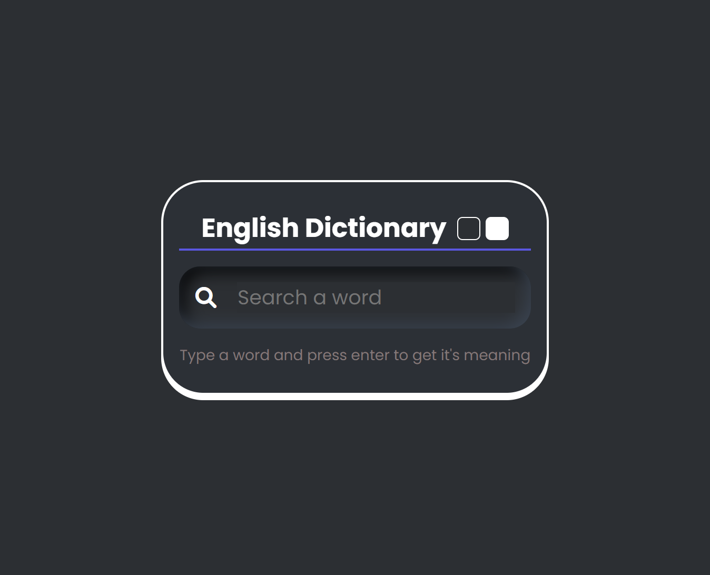
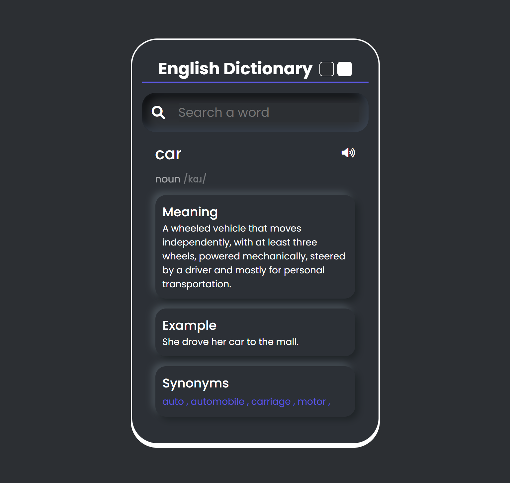
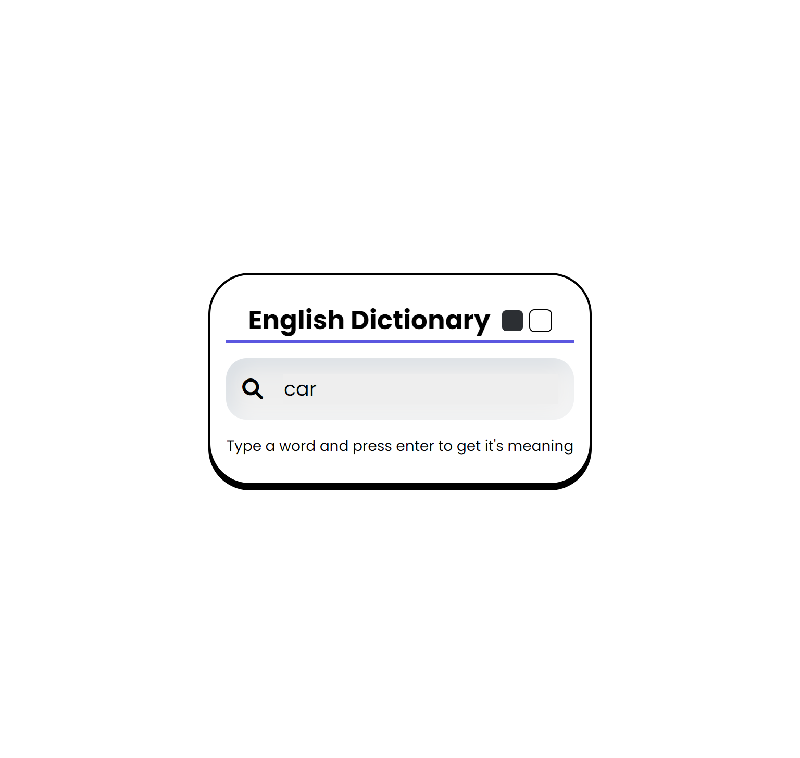
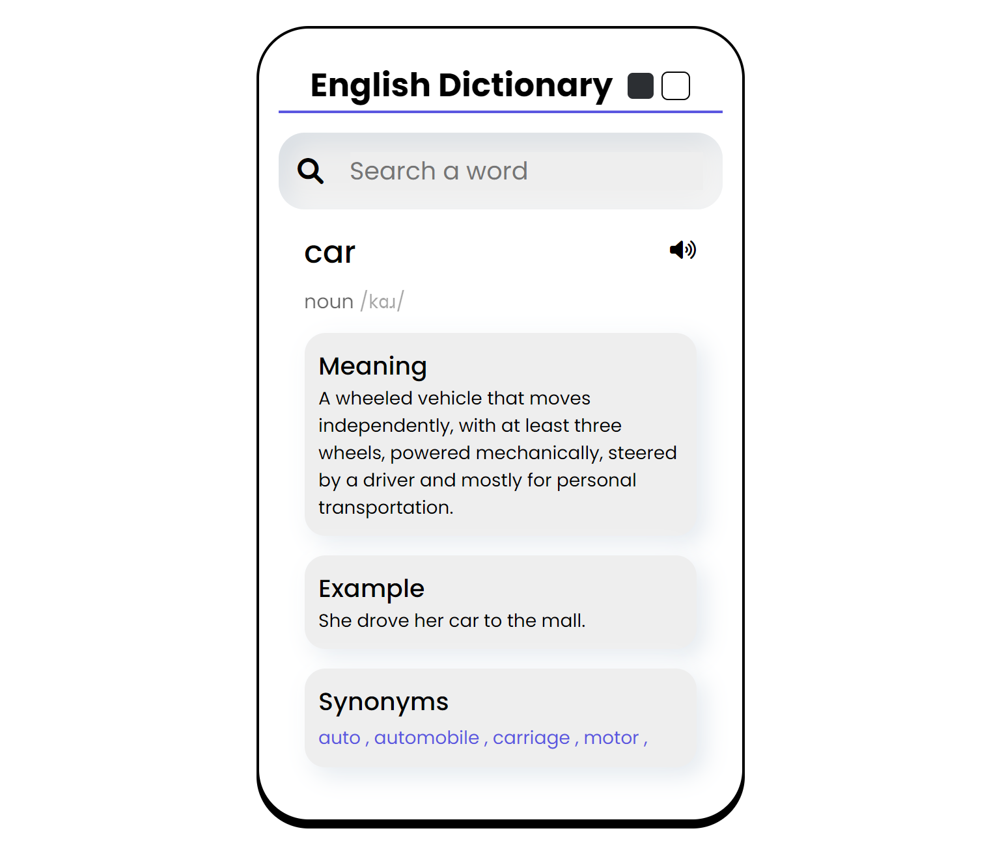

# Dictionary Web App

## By Abenezer Demissie

## Table of contents

- [Overview](#overview)
  - [The challenge](#the-challenge)
  - [Screenshot](#screenshot)
  - [Links](#links)
- [My process](#my-process)
  - [Built with](#built-with)
- [Author](#author)

## Overview

### The challenge

Users should be able to:

- View the optimal layout depending on their device's screen size.
- View light and dark mode.
- See hover states for interactive elements.
- Get the user input then fetch the meaning of the word from the web.
- View error message if word's meaning is not found.

### Screenshot

### Links

- Solution URL: [Solution URL here](https://dictionary-web-app.pages.dev/)

## My process

### Built with

- Semantic HTML5 markup
- CSS custom properties
- FlexBox
- Vanilla javascript
- Api - [Free Dictionary Api](https://dictionaryapi.dev/)

## Author

- Abenezer Demissie
- Frontend Mentor - [@Abenezer46](https://www.frontendmentor.io/profile/Abenezer46)
- GetHub - [@Abenezer46](https://github.com/Abenezer46)
